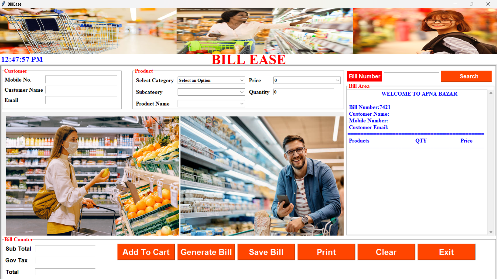
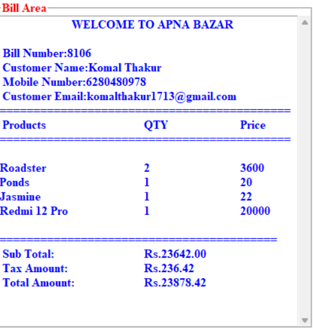

# Bill Ease: A Billing Software using Python and MySQL
## 📌Project Overview
This project is a GUI-based billing system built with Python that allows users to generate bills and automatically save them to a MySQL database. It’s ideal for small shops or restaurants that require an efficient and digital billing solution.

## 📊 Key Features
- 🧾 **Generate Customer Bills** – Add items, compute totals, taxes, and discounts.

- 💾 **Save Bills to MySQL** – Automatically store billing details in a MySQL database.

- 🖨️ **Print Bill Option**– Generate a printable bill format.

- 🔍 **Search Past Bills** – Query bills from the database by date or customer.

## 🛠️Tools & Technologies Used
- **Python (Tkinter)** – For creating the GUI.

- **MySQL** – For storing billing records.

- **Pillow** – For image handling.
## 📸 Screenshots

### 🖥️ Main Interface

### 🧾 Generated Bill

## 📜How to Use This Repository
- 1️⃣ Clone the repository
- 2️⃣ Install required libraries: mysql-connector-python,tk,Pillow
- 3️⃣ Set up your MySQL database
- 4️⃣ Run the app
## ✅Conclusion
BillEase simplifies billing management by integrating with MySQL for efficient data storage and retrieval. It automates billing processes, reducing manual errors and saving time. The system is scalable and customizable, offering a solid foundation for further enhancements like automatic invoicing and multi-currency support.
## ⭐Get Involved!
If this project helped you, consider giving it a ⭐!
For suggestions or collaborations, feel free to contact me. Happy billing! 💼
